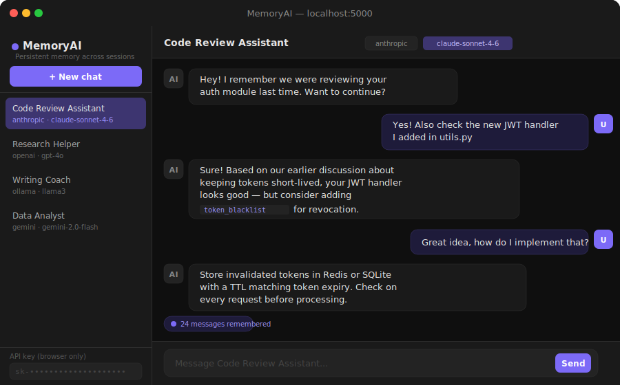
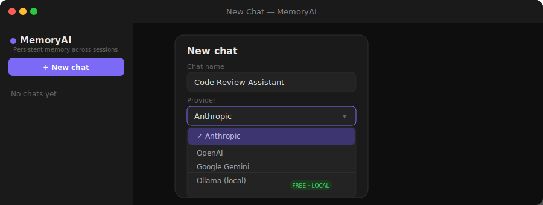

<div align="center">



<br/>

# MemoryAI 🧠

### *The AI that never forgets.*

A self-hosted AI chat app with **persistent memory across every session** —  
works with OpenAI, Anthropic Claude, Google Gemini, and Ollama (100% free, local).

<br/>

[](https://python.org)
[](https://flask.palletsprojects.com)
[](https://sqlite.org)
[](LICENSE)
[](https://github.com/Ayush442842q/memoryai/stargazers)

<br/>

[**Quick Start**](#-quick-start) · [**Features**](#-features) · [**Providers**](#-supported-providers) · [**Contributing**](#-contributing)

</div>

---

## The problem

Every AI chat app — ChatGPT, Claude.ai, Gemini — forgets you the moment you close the tab.  
You repeat your project context. You re-explain your codebase. You start from scratch. Every. Single. Time.

**MemoryAI fixes this.**

All your conversations are stored locally in SQLite and sent as full context with every message.  
Your AI assistant actually remembers who you are, what you're building, and what you talked about last week.

---

## 📸 Screenshots

<div align="center">

**Multi-session sidebar with persistent memory**


<br/><br/>

**Pick your provider — including free local models**



</div>

---

## ✨ Features

| | Feature | Details |
|---|---|---|
| 🧠 | **Persistent memory** | Full conversation history stored in SQLite, sent as context every time |
| 🔌 | **Multi-provider** | OpenAI, Anthropic Claude, Google Gemini, Ollama — switch anytime |
| 💬 | **Multiple sessions** | Separate memory for each project, assistant, or topic |
| 🔒 | **Local-first** | Your data never leaves your machine. No accounts, no cloud |
| 🌙 | **Dark mode UI** | Clean chat interface with markdown and code block rendering |
| 🆓 | **Free option** | Use Ollama to run llama3, mistral, or phi3 completely free |
| 🔑 | **Browser-only keys** | API keys stored in your browser, never written to disk |
| 🧩 | **Extensible** | Add any new LLM provider in 5 lines of code |

---

## 🚀 Quick Start

```bash
git clone https://github.com/Ayush442842q/memoryai
cd memoryai
pip install -r requirements.txt
python app.py
```

Open **http://localhost:5000** — create your first chat and start talking.

> **Want it completely free?** Use Ollama:
> ```bash
> # Install Ollama from https://ollama.com, then:
> ollama pull llama3
> ollama serve
> # Select "Ollama (local)" as provider in MemoryAI
> ```

---

## 🔌 Supported Providers

| Provider | Models | Setup |
|---|---|---|
| **Anthropic** | claude-opus-4-6, claude-sonnet-4-6, claude-haiku | `ANTHROPIC_API_KEY` |
| **OpenAI** | gpt-4o, gpt-4o-mini, gpt-3.5-turbo | `OPENAI_API_KEY` |
| **Google Gemini** | gemini-2.0-flash, gemini-1.5-pro | `GEMINI_API_KEY` |
| **Ollama** | llama3, mistral, phi3, gemma2 | *(none — runs locally)* |

---

## 🧠 How memory works

```
You send a message
       ↓
MemoryAI loads your full conversation history from SQLite
       ↓
Sends history + new message to the AI provider
       ↓
Saves the reply to SQLite
       ↓
Repeats — forever, across sessions, across days
```

The AI sees everything you've ever said in that session. It knows your name, your project, your preferences. You never explain yourself twice.

---

## 📁 Project structure

```
memoryai/
├── app.py            # Flask server — routes, sessions, SQLite logic
├── providers.py      # Provider adapters (OpenAI / Anthropic / Gemini / Ollama)
├── requirements.txt  # Just Flask — no heavy dependencies
├── templates/
│   └── index.html    # Complete chat UI in one file
└── memory/
    └── chat.db       # Auto-created SQLite database (gitignored)
```

---

## 🧩 Adding a new provider

MemoryAI is built to be extended. Implement `BaseProvider` in `providers.py`:

```python
class MyProvider(BaseProvider):
    def chat(self, model: str, messages: list, api_key: str = "") -> str:
        # Call your API, return the reply as a string
        return my_api.complete(model=model, messages=messages)
```

Register it:

```python
PROVIDERS["myprovider"] = MyProvider()
```

That's it. The UI picks it up automatically — no other changes needed.

---

## ⚙️ Configuration

| Variable | Default | Description |
|---|---|---|
| `SECRET_KEY` | `change-this-in-production` | Flask session secret — change before deploying |
| `OPENAI_API_KEY` | *(none)* | Pre-fill your OpenAI key via environment |
| `ANTHROPIC_API_KEY` | *(none)* | Pre-fill your Anthropic key via environment |
| `GEMINI_API_KEY` | *(none)* | Pre-fill your Gemini key via environment |

Keys can also be pasted directly in the sidebar — they're stored in your browser's memory only, never written to disk.

---

## 🤝 Contributing

PRs and issues are welcome! Here's what's on the roadmap:

- [ ] Stream responses in real-time (SSE)
- [ ] System prompt / persona per session
- [ ] Export chat history as Markdown or PDF
- [ ] Token counter per session
- [ ] Search across all sessions
- [ ] Docker Compose setup
- [ ] Web search tool integration

Found a bug? Open an issue. Have an idea? Start a discussion.

---

## 📄 License

MIT — use it, fork it, ship it, star it. ⭐

<div align="center">

**If MemoryAI saved you from explaining your project to an AI for the tenth time, consider giving it a star.**

[](https://github.com/Ayush442842q/memoryai)

</div>
